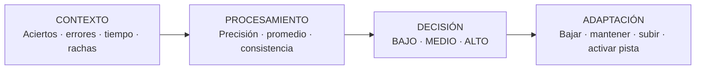
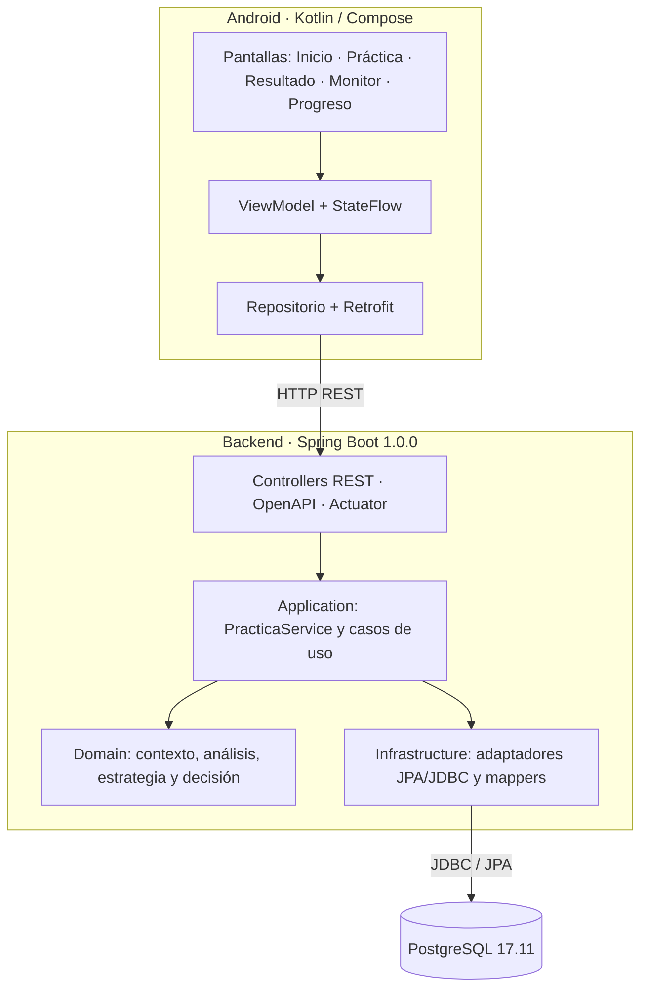

# AdaptiveQuiz

**Taller 001 — Desarrollo de una Aplicación Adaptativa**

**SI806 — Desarrollo Adaptativo e Integrado de Software**

**Alumno: Edwin Kennedy Calero Chamorro**

**Universidad Nacional de Ingeniería — 2026-II**

Aplicación móvil que adapta automáticamente la dificultad y las ayudas de aprendizaje según el rendimiento real del estudiante.

## ¿Qué es AdaptiveQuiz?

AdaptiveQuiz es una aplicación de práctica para estudiantes. Después de cada respuesta observa lo que realmente ocurrió, interpreta el desempeño y ajusta la siguiente experiencia de aprendizaje sin pedir al estudiante que configure un nivel.

El producto está pensado para hacer visible el comportamiento adaptativo exigido por el Taller 001: la app responde a datos de uso reales y deja una explicación auditable de cada decisión.

## Problema

Estudiantes con ritmos y resultados distintos no deberían recibir necesariamente la misma secuencia rígida de ejercicios. Una respuesta incorrecta repetida requiere refuerzo; una secuencia correcta y rápida puede requerir un reto mayor.

## Solución

AdaptiveQuiz observa automáticamente:

- aciertos;
- errores;
- tiempo de respuesta;
- rachas;
- dificultad actual.

Con esa evidencia adapta automáticamente:

- la dificultad del siguiente ejercicio;
- la disponibilidad de una pista o ayuda.

**El estudiante no selecciona manualmente su nivel.**

## Pipeline adaptativo



El backend persiste el contexto, la regla aplicada, la acción, la dificultad anterior y nueva, el motivo y la fecha de cada decisión. La siguiente consulta de ejercicio consume ese progreso; la aplicación Android sólo representa la decisión recibida.

## Arquitectura certificada



- **Android:** interfaz en español con `ViewModel`, `StateFlow`, Retrofit y Material 3.
- **Backend modular:** `domain`, `application`, `infrastructure` y `api`, bajo el namespace `com.veltia.adaptivequiz`.
- **Datos:** PostgreSQL y Flyway; `database/` es la fuente canónica de las migraciones y el seed.
- **Motor:** `LearningContextBuilder` → `DefaultPerformanceAnalyzer` → `AdaptationEngine` → `RuleBasedAdaptationStrategy` → `AdaptationActionPersistenceService`.

AdaptiveQuiz es independiente de VAEF. Reutiliza convenciones técnicas consolidadas del workspace, pero no depende funcionalmente de servicios VAEF.

## Qué está implementado

| Capacidad | Resultado verificable |
|---|---|
| Contexto real | Ventana móvil de hasta cinco intentos recientes disponibles, según `tamano_ventana_intentos` de la política. |
| Procesamiento | Precisión, tiempo promedio, rachas, dificultad y tipo de ejercicio. |
| Decisión | Reglas parametrizadas `R_BAJO_RACHA`, `R_BAJO_PRECISION`, `R_ALTO` y `R_MEDIO`, evaluadas por prioridad. |
| Adaptación | Subir, mantener o bajar dificultad; activar pista para desempeño bajo. |
| Trazabilidad | Persistencia en `PRA_*`, `APR_PROGRESO_TEMA`, `ADP_CONTEXTO_APRENDIZAJE`, `ADP_EVENTO_ADAPTACION` y `ADP_ACCION_EVENTO`. |
| Observabilidad | Monitor Adaptativo muestra **CONTEXTO → PROCESAMIENTO → DECISIÓN → ADAPTACIÓN**. |

Las reglas respetan los límites `BASICO` y `AVANZADO`. La estrategia del Taller es determinista y está parametrizada en `CFG_POLITICA_ADAPTACION`, `CFG_REGLA_ADAPTACION` y `CFG_PARAMETRO`.

## Requisitos para ejecutar localmente

- Git.
- Docker Desktop.
- JDK 17.
- Maven 3.9 o compatible.
- Android Studio con Android SDK Platform 37 para el build Android actual.

## Inicio rápido reproducible

Clone el repositorio y cree un archivo de configuración local a partir del ejemplo versionado:

```powershell
git clone https://github.com/devfixexpress-debug/adaptive-quiz.git
Set-Location adaptive-quiz
Copy-Item .env.example .env
```

El archivo `.env` no se versiona. Los valores de `.env.example` son exclusivos para desarrollo local; no reemplace el archivo de ejemplo por credenciales reales.

### 1. Levantar PostgreSQL

```powershell
docker compose --env-file .env up -d db
docker compose --env-file .env ps
```

El contenedor PostgreSQL 17 expone el puerto de desarrollo **55432** en el host y conserva `5432` dentro del contenedor. En una clonación nueva, Flyway aplicará V1, V1.1 y V2 cuando arranque el backend. No es necesario ni recomendable editar las migraciones certificadas.

### 2. Levantar el backend

En una consola distinta:

```powershell
$env:ADAPTIVEQUIZ_ENV_FILE = (Resolve-Path .env).Path
Push-Location backend
mvn -B clean verify
java -jar adaptive-quiz-api/target/adaptive-quiz-api-1.0.0.jar
```

Espere el arranque de Spring Boot y compruebe:

```text
http://localhost:8080/actuator/health
http://localhost:8080/api-docs
http://localhost:8080/swagger-ui/index.html
```

El health esperado es `UP`. Hibernate valida el esquema (`ddl-auto=validate`); no lo genera automáticamente.

### 3. Ejecutar Android

Abra la carpeta `mobile/` con Android Studio y ejecute la configuración `app` en un emulador. También puede generar el APK desde PowerShell:

```powershell
Push-Location mobile
$env:ANDROID_HOME = "$env:LOCALAPPDATA\Android\Sdk"
$env:ANDROID_SDK_ROOT = $env:ANDROID_HOME
.\gradlew.bat lintDebug assembleDebug
Pop-Location
```

El APK debug queda en `mobile/app/build/outputs/apk/debug/app-debug.apk`. Para el emulador, la URL predeterminada es `http://10.0.2.2:8080/`; se centraliza en `adaptiveQuizApiBaseUrl` de `mobile/gradle.properties` y se inyecta mediante `BuildConfig`. Para un dispositivo físico sólo se cambia esa propiedad por la dirección de red del backend.

## API disponible

| Método | Ruta |
|---|---|
| GET | `/api/v1/asignaturas` |
| GET | `/api/v1/asignaturas/{id}/temas` |
| GET | `/api/v1/ejercicios/{id}` |
| GET | `/api/v1/ejercicios/siguiente?estudianteId={id}&temaId={id}` |
| POST | `/api/v1/sesiones-practica` |
| POST | `/api/v1/intentos` |
| GET | `/api/v1/estudiantes/{id}/progreso` |
| GET | `/api/v1/estudiantes/{id}/progreso/{temaId}` |
| GET | `/api/v1/estudiantes/{id}/adaptaciones` |
| GET | `/api/v1/adaptaciones/{id}` |

El detalle de solicitudes y respuestas está en el [contrato REST](docs/05-api/01_API_CONTRACT.md) y también se puede consultar desde Swagger.

## Cómo demostrar la adaptación

1. Abra la app y pulse **COMENZAR PRÁCTICA** para Estudiante Demo y Álgebra. Observe que no existe un selector de dificultad.
2. Responda una práctica; el tiempo se mide desde que se presenta el ejercicio hasta la confirmación de la respuesta.
3. Abra **Monitor Adaptativo**. Debe poder leer contexto, rendimiento, regla, decisión, cambio de dificultad y motivo.
4. Consulte **Progreso** o `GET /api/v1/estudiantes/1/adaptaciones` para revisar el historial persistido.
5. Como evidencia ya certificada, los eventos reales incluyen: `INTERMEDIO → AVANZADO` por `R_ALTO`; descenso por `R_BAJO_PRECISION`; descenso por `R_BAJO_RACHA`; y `ACTIVAR_PISTA`.

El guion exacto de cinco minutos está en [03_DEMO_SCRIPT.md](docs/07-delivery/03_DEMO_SCRIPT.md). No se reinician los datos de demostración certificados para realizar esta entrega.

## Ubicación del código relevante

- [Orquestación de práctica](backend/adaptive-quiz-application/src/main/java/com/veltia/adaptivequiz/application/service/PracticaService.java).
- [Construcción de contexto](backend/adaptive-quiz-application/src/main/java/com/veltia/adaptivequiz/application/service/LearningContextBuilder.java).
- [Análisis de rendimiento](backend/adaptive-quiz-domain/src/main/java/com/veltia/adaptivequiz/domain/adaptation/DefaultPerformanceAnalyzer.java).
- [Estrategia determinista](backend/adaptive-quiz-domain/src/main/java/com/veltia/adaptivequiz/domain/adaptation/RuleBasedAdaptationStrategy.java).
- [Persistencia de acciones](backend/adaptive-quiz-application/src/main/java/com/veltia/adaptivequiz/application/service/AdaptationActionPersistenceService.java).
- [Monitor Android](mobile/app/src/main/java/com/veltia/adaptivequiz/mobile/feature/monitor/MonitorScreen.kt).
- [Migraciones canónicas](database/migrations/postgresql/) y [seed canónico](database/seeds/postgresql/).

## Calidad, CI y release

- El backend ejecutó `mvn clean verify` con **12 pruebas**, sin fallos, y fue certificado además contra Spring Boot y PostgreSQL reales.
- Android ejecutó `lintDebug assembleDebug`; el APK debug fue generado y probado en `emulator-5554` contra el backend real.
- [Backend CI](https://github.com/devfixexpress-debug/adaptive-quiz/actions/runs/34256991473) y [Android CI](https://github.com/devfixexpress-debug/adaptive-quiz/actions/runs/34256991453) finalizaron correctamente para el commit de `main` auditado.
- La [release académica v1.0.0](https://github.com/devfixexpress-debug/adaptive-quiz/releases/tag/v1.0.0) está publicada; el tag permanece inmutable.

Las evidencias de runtime, base de datos, motor y Android están en [docs/08-evidence](docs/08-evidence/). Los workflows existentes se encuentran en `.github/workflows/`.

## Material para el docente

- [Matriz maestra de cumplimiento del Taller 001](docs/07-delivery/06_CUMPLIMIENTO_TALLER_001.md).
- [Documento técnico de máximo dos páginas al exportar](docs/07-delivery/01_TALLER_001_DOCUMENTO_TECNICO.md).
- [Guion de presentación de 3 minutos](docs/07-delivery/02_PRESENTATION_SCRIPT.md).
- [Guion de demo de 5 minutos](docs/07-delivery/03_DEMO_SCRIPT.md).
- [Preparación para revisión técnica](docs/07-delivery/04_TECHNICAL_CHALLENGE_PREP.md).
- [Checklist de entrega](docs/07-delivery/05_DELIVERY_CHECKLIST.md).
- [Diagramas de contexto, pipeline, componentes, secuencia, datos y despliegue](database/diagrams/).

## Alcance de IA

La IA no forma parte de esta entrega. El Taller 001 funciona íntegramente con `RuleBasedAdaptationStrategy`; `AdaptationStrategy` deja preparada una extensión futura sin conectar SDK, claves ni proveedor externo.
