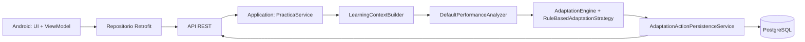

# Arquitectura certificada

## Principios

- AdaptiveQuiz es un proyecto independiente de VAEF; reutiliza convenciones técnicas del workspace sin dependencias funcionales con otros servicios.
- La adaptación pertenece al backend; Android consume y explica la decisión, pero no replica reglas ni umbrales.
- El modelo de datos es relacional, parametrizado y auditable.
- Las migraciones V1, V1.1 y V2 son inmutables; Flyway las aplica desde los recursos empaquetados a partir de la fuente canónica `database/`.
- La IA no está conectada en v1.0.0. `AdaptationStrategy` sólo conserva una extensión futura desacoplada.

## Módulos backend

```text
backend/
├── adaptive-quiz-domain/         modelo, contratos y motor determinista
├── adaptive-quiz-application/    casos de uso y orquestación de práctica
├── adaptive-quiz-infrastructure/ adaptadores JPA/JDBC, mappers y PostgreSQL
└── adaptive-quiz-api/            Spring Boot, REST, Flyway, OpenAPI y Actuator
```

## Regla de dependencias

```text
API → APPLICATION → DOMAIN
         ↓
  INFRASTRUCTURE (adaptadores de los puertos)
         ↓
     PostgreSQL
```

El dominio no depende de Spring Web, JPA, Android ni de un proveedor de IA. En ejecución, la composición de dependencias conecta los puertos de dominio/aplicación con los adaptadores de infraestructura.

## Configuración paramétrica para sustentación

La pantalla Android identificada como uso docente consulta una API limitada. Esta API actualiza sólo
la ventana de `CFG_POLITICA_ADAPTACION` y los umbrales/pista permitidos de
`CFG_REGLA_ADAPTACION`; no crea reglas ni asigna dificultad a estudiantes. La siguiente evaluación
lee la política persistida por su identificador de sesión, por lo que no requiere recompilar ni
reiniciar el servicio. El detalle visual está en [Configuración paramétrica](diagrams/08_CONFIGURACION_PARAMETRICA.mmd).

## Flujo de responsabilidades



## Persistencia y esquema

`database/` conserva la fuente canónica: V1 es el esquema, V1.1 es el seed y V2 incorpora los parámetros del MVP. Durante el empaquetado, `adaptive-quiz-api` incluye esos SQL en `classpath:db/migration`; Flyway los ejecuta y Hibernate sólo valida el esquema con `ddl-auto=validate`.
